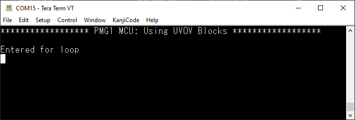
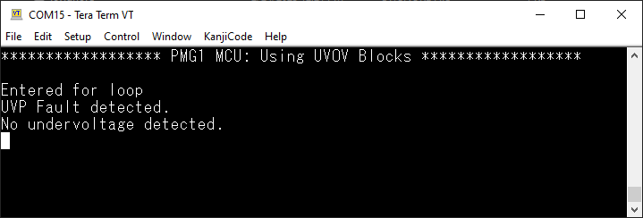
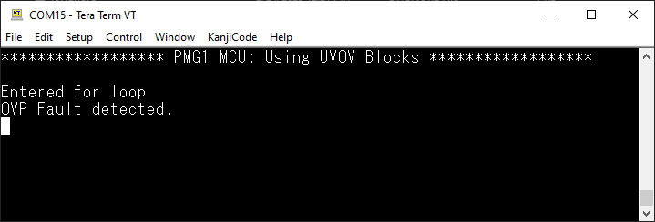
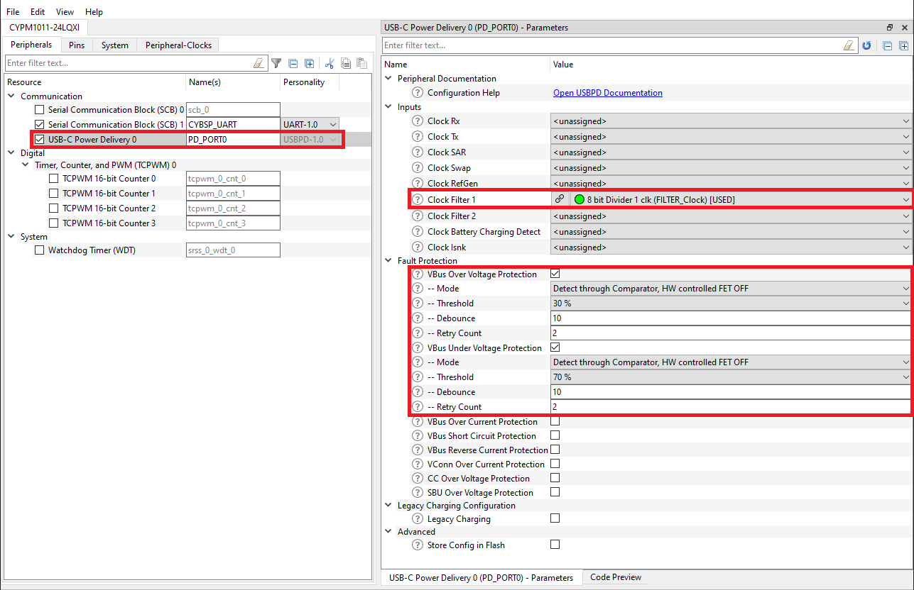
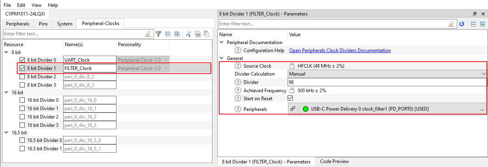
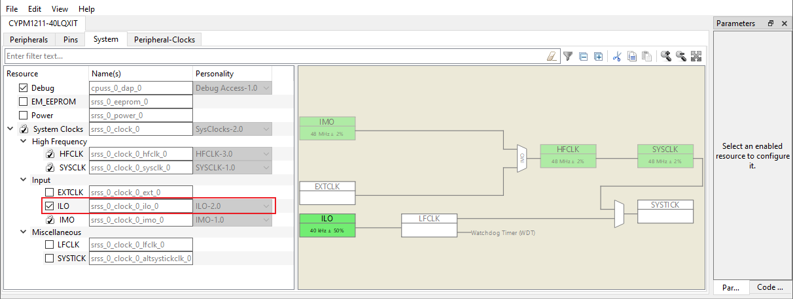
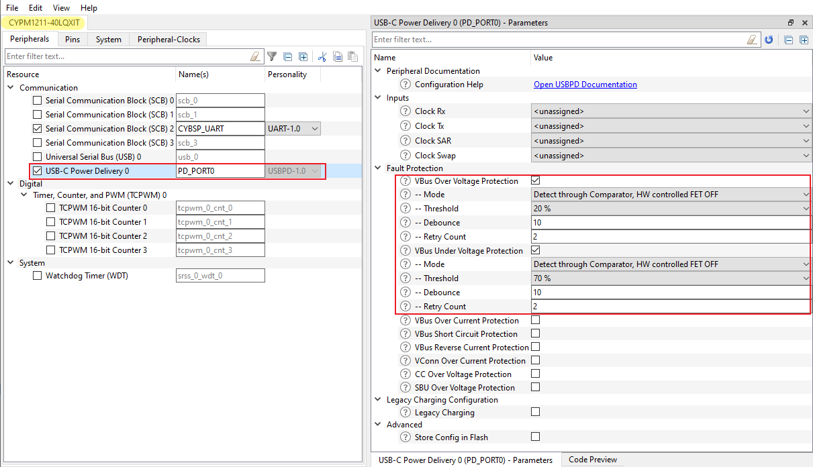
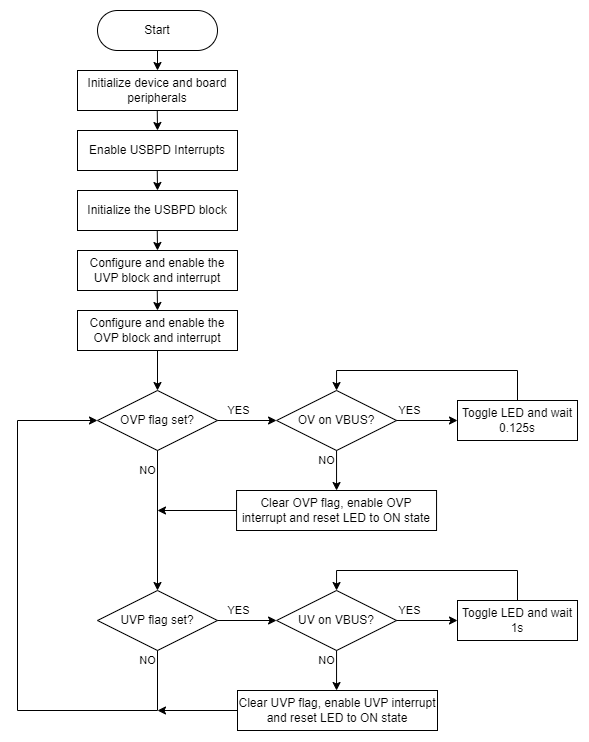

# EZ-PD&trade; PMG1 MCU: Using UVP and OVP blocks

This code example demonstrates the  use of the overvoltage protection(OVP) and undervoltage protection(UVP) blocks for high-voltage and low-voltage detection on the Type-C Vbus pin of EZ-PD&trade; PMG1 MCU devices. The UVOV block are used as a standalone block in this code example.

[View this README on GitHub.](https://github.com/Infineon/mtb-example-pmg1-uvov-blocks)

[Provide feedback on this code example.](https://cypress.co1.qualtrics.com/jfe/form/SV_1NTns53sK2yiljn?Q_EED=eyJVbmlxdWUgRG9jIElkIjoiQ0UyMzcyMzAiLCJTcGVjIE51bWJlciI6IjAwMi0zNzIzMCIsIkRvYyBUaXRsZSI6IkVaLVBEJnRyYWRlOyBQTUcxIE1DVTogVXNpbmcgVVZQIGFuZCBPVlAgYmxvY2tzIiwicmlkIjoidmlsbGVnYXN1bHlzIiwiRG9jIHZlcnNpb24iOiIxLjAuMCIsIkRvYyBMYW5ndWFnZSI6IkVuZ2xpc2giLCJEb2MgRGl2aXNpb24iOiJNQ0QiLCJEb2MgQlUiOiJXSVJFRCIsIkRvYyBGYW1pbHkiOiJUWVBFLUMifQ==)

## Requirements

- [ModusToolbox&trade; software](https://www.infineon.com/modustoolbox) v3.0 or later (tested with v3.0)
- Board support package (BSP) minimum required version: 3.0.0
- Programming language: C
- Associated parts: All [EZ-PD&trade; PMG1 MCU](https://www.infineon.com/PMG1) parts


## Supported toolchains (make variable 'TOOLCHAIN')

- GNU Arm&reg; embedded compiler v10.3.1 (`GCC_ARM`) - Default value of `TOOLCHAIN`
- Arm&reg; compiler v6.16 (`ARM`)
- IAR C/C++ compiler v9.30.1 (`IAR`)


## Supported kits (make variable 'TARGET')

- [EZ-PD&trade; PMG1-S0 prototyping kit](https://www.infineon.com/CY7110) (`PMG1-CY7110`) - Default value of `TARGET`
- [EZ-PD&trade; PMG1-S1 prototyping kit](https://www.infineon.com/CY7111) (`PMG1-CY7111`)
- [EZ-PD&trade; PMG1-S2 prototyping kit](https://www.infineon.com/CY7112) (`PMG1-CY7112`)
- [EZ-PD&trade; PMG1-S3 prototyping kit](https://www.infineon.com/CY7113) (`PMG1-CY7113`)


## Hardware setup

1. Ensure that the board is configured correctly (see the kit user guide).

2. Connect the UART TX and UART RX lines from the PMG1 kit to J3.8 and J3.10 on KitProg3 respectively to establish a UART connection between KitProg3 and the EZ-PD&trade; PMG1 device for the following revisions of the PMG1 prototyping kits.

**Table 1: EZ-PD&trade; PMG1 kit UART connection**

|PMG1 prototyping kit              | UART TX       | UART RX       |
| :------------------------------  | :-------------| :-------------|
|PMG1-CY7110 (revision 3 or lower) | J6.10 to J3.8 | J6.9 to J3.10 |
|PMG1-CY7111 (revision 2 or lower) | J6.10 to J3.8 | J6.9 to J3.10 |
|PMG1-CY7112 (revision 2 or lower) | J6.10 to J3.8 | J6.9 to J3.10 |
|PMG1-CY7113 (revision 3 or lower) | J6.10 to J3.8 | J6.9 to J3.10 |

**Note:** All PMG1 protoyping kits with a higher revision have UART pins internally connected. Therefore, an external wiring is not required.
If UART `DEBUG_PRINT` messages are enabled, UART connection is needed. See compile-time configuration for more details.

## Software setup

Install a terminal emulator to display the serial data. Instructions in this document use [Tera Term](https://ttssh2.osdn.jp/index.html.en).


**Note:** If the `DEBUG_PRINT` macro is enabled, Tera Term is used to view UART print messages.


## Using the code example

Create the project and open it using one of the following:

<details><summary><b>In Eclipse IDE for ModusToolbox&trade; software</b></summary>

1. Click the **New Application** link in the **Quick Panel** (or, use **File** > **New** > **ModusToolbox&trade; Application**). This launches the [Project Creator](https://www.infineon.com/ModusToolboxProjectCreator) tool.

2. Pick a kit supported by the code example from the list shown in the **Project Creator - Choose Board Support Package (BSP)** dialog.

   When you select a supported kit, the example is reconfigured automatically to work with the kit. To work with a different supported kit later, use the [Library Manager](https://www.infineon.com/ModusToolboxLibraryManager) to choose the BSP for the supported kit. You can use the Library Manager to select or update the BSP and firmware libraries used in this application. To access the Library Manager, click the link from the **Quick Panel**.

   You can also just start the application creation process again and select a different kit.

   If you want to use the application for a kit not listed here, you may need to update the source files. If the kit does not have the required resources, the application may not work.

3. In the **Project Creator - Select Application** dialog, choose the example by enabling the checkbox.

4. (Optional) Change the suggested **New Application Name**.

5. The **Application(s) Root Path** defaults to the Eclipse workspace which is usually the desired location for the application. If you want to store the application in a different location, you can change the *Application(s) Root Path* value. Applications that share libraries should be in the same root path.

6. Click **Create** to complete the application creation process.

For more details, see the [Eclipse IDE for ModusToolbox&trade; software user guide](https://www.infineon.com/MTBEclipseIDEUserGuide) (locally available at *{ModusToolbox&trade; software install directory}/docs_{version}/mt_ide_user_guide.pdf*).

</details>

<details><summary><b>In command-line interface (CLI)</b></summary>

ModusToolbox&trade; software provides the Project Creator as both a GUI tool and the command line tool, "project-creator-cli". The CLI tool can be used to create applications from a CLI terminal or from within batch files or shell scripts. This tool is available in the *{ModusToolbox&trade; software install directory}/tools_{version}/project-creator/* directory.

Use a CLI terminal to invoke the "project-creator-cli" tool. On Windows, use the command line "modus-shell" program provided in the ModusToolbox&trade; software installation instead of a standard Windows command-line application. This shell provides access to all ModusToolbox&trade; software tools. You can access it by typing `modus-shell` in the search box in the Windows menu. In Linux and macOS, you can use any terminal application.

The "project-creator-cli" tool has the following arguments:

Argument | Description | Required/optional
---------|-------------|-----------
`--board-id` | Defined in the `<id>` field of the [BSP](https://github.com/Infineon?q=bsp-manifest&type=&language=&sort=) manifest | Required
`--app-id`   | Defined in the `<id>` field of the [CE](https://github.com/Infineon?q=ce-manifest&type=&language=&sort=) manifest | Required
`--target-dir`| Specify the directory in which the application is to be created if you prefer not to use the default current working directory | Optional
`--user-app-name`| Specify the name of the application if you prefer to have a name other than the example's default name | Optional

<br />

The following example clones the "[Using UVP and OVP blocks](https://github.com/Infineon/mtb-example-pmg1-uvov-blocks)" application with the desired name "uvov_blocks" configured for the *PMG1-CY7110* BSP into the specified working directory, *C:/mtb_projects*:

   ```
   project-creator-cli --board-id PMG1-CY7110 --app-id mtb-example-pmg1-uvov-blocks --user-app-name uvov_blocks --target-dir "C:/mtb_projects"
   ```

**Note:** The project-creator-cli tool uses the `git clone` and `make getlibs` commands to fetch the repository and import the required libraries. For details, see the "Project creator tools" section of the [ModusToolbox&trade; software user guide](https://www.infineon.com/ModusToolboxUserGuide) (locally available at *{ModusToolbox&trade; software install directory}/docs_{version}/mtb_user_guide.pdf*).

To work with a different supported kit later, use the [Library Manager](https://www.infineon.com/ModusToolboxLibraryManager) to choose the BSP for the supported kit. You can invoke the Library Manager GUI tool from the terminal using `make library-manager` command or use the Library Manager CLI tool "library-manager-cli" to change the BSP.

The "library-manager-cli" tool has the following arguments:

Argument | Description | Required/optional
---------|-------------|-----------
`--add-bsp-name` | Name of the BSP that should be added to the application | Required
`--set-active-bsp` | Name of the BSP that should be as active BSP for the application | Required
`--add-bsp-version`| Specify the version of the BSP that should be added to the application if you do not wish to use the latest from manifest | Optional
`--add-bsp-location`| Specify the location of the BSP (local/shared) if you prefer to add the BSP in a shared path | Optional

<br />

The following example adds the PMG1-CY7110 BSP to the already created application and makes it the active BSP for the app:

   ```
   ~/ModusToolbox/tools_3.0/library-manager/library-manager-cli --project "C:/mtb_projects/MyUVOVBlocks" --add-bsp-name PMG1-CY7110 --add-bsp-version "latest-v3.X" --add-bsp-location "local"

   ~/ModusToolbox/tools_3.0/library-manager/library-manager-cli --project "C:/mtb_projects/MyUVOVBlocks" --set-active-bsp APP_PMG1-CY7110
   ```

</details>

<details><summary><b>In third-party IDEs</b></summary>

Use one of the following options:

- **Use the standalone [Project Creator](https://www.infineon.com/ModusToolboxProjectCreator) tool:**

   1. Launch Project Creator from the Windows Start menu or from *{ModusToolbox&trade; software install directory}/tools_{version}/project-creator/project-creator.exe*.

   2. In the initial **Choose Board Support Package** screen, select the BSP, and click **Next**.

   3. In the **Select Application** screen, select the appropriate IDE from the **Target IDE** drop-down menu.

   4. Click **Create** and follow the instructions printed in the bottom pane to import or open the exported project in the respective IDE.

<br />

- **Use command-line interface (CLI):**

   1. Follow the instructions from the **In command-line interface (CLI)** section to create the application, and then import the libraries using the `make getlibs` command.

   2. Export the application to a supported IDE using the `make <ide>` command.

   3. Follow the instructions displayed in the terminal to create or import the application as an IDE project.

For a list of supported IDEs and more details, see the "Exporting to IDEs" section of the [ModusToolbox&trade; software user guide](https://www.infineon.com/ModusToolboxUserGuide) (locally available at *{ModusToolbox&trade; software install directory}/docs_{version}/mtb_user_guide.pdf*).

</details>


## Operation

1. Ensure that the steps listed in the [Hardware setup](#hardware-setup) section are completed.

2. Ensure that the jumper shunt on power selection jumper (J5) is placed at position 2-3(programming mode)  to enable programming.

3. Connect the board to the PC using the USB cable through the KitProg3 USB connector(J1). This cable is used for programming the PMG1 device and as a USB-UART bridge to the PC during operation.

4. Program the board using one of the following:

   <details><summary><b>Using Eclipse IDE for ModusToolbox&trade; software</b></summary>

      1. Select the application project in the Project Explorer.

      2. In the **Quick Panel**, scroll down, and click **\<Application Name> Program (KitProg3_MiniProg4)**.
   </details>

   <details><summary><b>Using CLI</b></summary>

     From the terminal, execute the `make program` command to build and program the application using the default toolchain to the default target. The default toolchain is specified in the application's Makefile but you can override this value manually:
      ```
      make program TOOLCHAIN=<toolchain>
      ```

      Example:
      ```
      make program TOOLCHAIN=GCC_ARM
      ```
   </details>

5. After programming the kit, disconnect the USB cable and change the position on power selection jumper (J5) to 1-2 to power the kit through the USBPD port.

6. If the `DEBUG_PRINT` macro is enabled, to see the UART messages, connect the USB cable back to the KitProg3 USB connector and open a terminal program. Select the KitProg3 COM port. Set the serial port parameters to 8N1 and 115200 baud.

7. Power the kit by connecting power to the VBUS_TYPE-C testpoint and GND testpoint. The application has both UVP and OVP enabled; the default threshold voltage is 5 V. Applying 5 V to the VBUS_TYPE-C testpoint of the PMG1 device will start the device in normal operation.

8. The application starts automatically. If debug print is enabled, confirm that "PMG1 MCU: Using UVOV Blocks" is displayed on the UART terminal as shown in **Figure 1**.

   **Figure 1. "PMG1 MCU: Using UVOV Blocks" in terminal output**

   

9. Confirm that the kit LED is ON.

10. To trigger the UVP interrupt, decrease the voltage on the VBUS_TYPE-C testpoint to a voltage less than 3.5 V (70% UVP threshold).

11. Confirm that the kit LED is toggling approximately every one second. If debug print is enabled, confirm that the UART terminal prints "UVP fault detected" as shown in **Figure 2**.

    **Figure 2. "UVP fault detected" in terminal output**

    

12. Increase the VBUS_TYPE-C testpoint voltage back to 5 V and confirm that the kit LED stays ON. If debug print is enabled, confirm that the UART terminal prints "No undervoltage detected" as shown in **Figure 3**.

    **Figure 3. "No undervoltage detected" in terminal output**

    

13. To trigger the OVP interrupt, increase the voltage on the VBUS_TYPE-C testpoint to a voltage greater than 6.5 V (30% OVP threshold).

14. Confirm that the kit LED toggles approximately 8 times every second. If debug print is enabled, confirm that the UART terminal prints "OVP fault detected" as shown in **Figure 4**.

    **Figure 4. "OVP fault detected" in terminal output**

    

15. Decrease the VBUS_TYPE-C testpoint voltage back to 5 V and confirm that the kit LED stays ON. If debug print is enabled, confirm that the UART terminal prints "No overvoltage detected" as shown in **Figure 5**.

    **Figure 5. "No overvoltage detected detected" in terminal output**

    
<br>

## Debugging

You can debug the example to step through the code. In the IDE, use the **\<Application Name> Debug (KitProg3_MiniProg4)** configuration in the **Quick Panel**. Ensure that the board is connected to your PC using the USB cable through the KitProg3 USB connector and the jumper shunt on power selection jumper (J5) is placed at position 1-2. See the "Debug mode" section in the kit user guide for debugging the application on CY7110 prototyping kit. For more details, see the "Program and debug" section in the [Eclipse IDE for ModusToolbox&trade; software user guide](https://www.infineon.com/MTBEclipseIDEUserGuide).
<br>

## Design and implementation

The UVOV block is part of the USBPD block in EZ-PD&trade; PMG1 devices and can be used as a standalone block without using USBPD functionality. The UVOV block can be independently configured to detect undervoltage or overvoltage on the Type-C Vbus pin of the PMG1 MCU.

### USBPD block Configuration

To use the UVOV block as a standalone block on the PMG1 MCU, the USBPD block needs to be enabled and configured with appropriate inputs depending on the PMG1 device. This setup can be done using the device configurator tool as shown **Figure 6**.

**Figure 6. PMG1-S0 USBPD configuration in device configurator**



In the device configurator, the UVP and OVP sections can be set to desired values. This application uses the following values for the UVP and OVP sections:

- *Mode:* 'Detect Through Comparator, HW controlled FET OFF' for both UVP and OVP.

- *Threshold:* The default percentage threshold of this application for UVP and OVP is 70% and 30%, respectively. UVP fault trips when the Type-C Vbus voltage is 70% of the threshold voltage. OVP fault trips when the Type-C Vbus voltage is 130% of the threshold voltage.
   (For example, if the threshold voltage is 5 V, UVP will trip when Type-C Vbus is 3.5 V or lower and OVP will trip when Type-C Vbus is 6.5 V or higher).

- *Debounce:* 10 (default value) for UVP and OVP

- *Retry Count:* 2 (default value) for UVP and OVP

### Clock configuration

On PMG1-S0, S1, and S3 devices, the USBPD block must have a clock filter to filter the output of the UV and OV comparators. The clock filter is a peripheral clock derived from the high-frequency clock (HFCLK) which is sourced by the internal main oscillator (IMO). The HFCLK and IMO are enabled by default, but the peripheral clock must be configured, as shown in **Figure 7**, and set as the clock filter 1 input to the USBPD block as shown in **Figure 6**. In this application the peripheral clock is configured with a frequency of 500 kHz.

**Figure 7. PMG1-S0 clock configuration in device configurator**



**Table 2** lists the USBPD clock inputs for each of the PMG1 devices.

**Table 2. PMG1 USBPD clock inputs required for UVP and OVP**

Device   | Clock filter 1
:------- | :-------------
PMG1-S0  | 500 kHz
PMG1-S1  | 500 kHz
PMG1-S2  | Not erquired
PMG1-S3  | 500 kHz

On PMG1-S2 device, the output of the UV and OV comparators go through a digital filter which runs at low-frequency clock (LFCLK) sourced by the internal low-speed oscillator (ILO). The ILO is not enabled by default, therefore it must be enabled on PMG1-S2 as shown in **Figure 8**. 

**Figure 8. PMG1-S2 system configuration in device configurator**



Unlike the other PMG1 devices, PMG1-S2 does not require a clock input to the USBPD block, therefore a seperate peripheral clock setup is not required. As shown in **Figure 9**, there is no clock input to the USBPD block in device configurator.

**Figure 9. PMG1-S2 USBPD configuration in device configurator**



### Design

On start up of the PMG1 device, the UVP and OVP blocks are enabled. During enabling of the UVP and OVP blocks, the provider FETs are configured to be automatically controlled by the UVOV block.
The user LED remains ON until either a UVP fault or OVP fault is detected:

- When a UVP or OVP fault is detected, the corresponding interrupt for UVP or OVP is triggered.

- The interrupt handler for either UVP or OVP calls the corresponding callback function. The callback function sets the corresponding UVP or OVP flag and the ISR is complete.

- If the UVP flag is set:
   - The UVP threshold is adjusted to a slightly higher voltage than the default and a hystersis is added to the UV Comparator to prevent any oscillation. (see *Note*).
   - The LED state will toggle every one second while the Vbus voltage is below the higher UV threshold.
   - Once there is no undervoltage on Vbus, the UVP flag is cleared. The UV threshold is set using the default voltage and the LED is reset to ON state.

- If the OVP flag is set: 
   - The OVP threshold is adjusted to a slightly lower voltage than the default and a hystersis is added to the OV Comparator to prevent any oscillation.(seee *Note*).
   - The LED state will toggle every 125 millisecond while the Vbus voltage is above the lower OV threshold.
   - Once there is no overvoltage on Vbus, the OVP flag is cleared. The OV threshold is set using the default voltage and the LED is reset to ON state.

- The firmware continues to monitor for UVP and OVP interrupts by checking the corresponding flags as shown in the firmware flowchart in **Figure 10**.

**Note:** When the Vbus voltage is at the edge of the default UV or OV threshold, the firmware may detect that there is UV or OV and no UV or OV repeatedly due to the fluctuations in the voltage. 
By increasing the UV threshold when a UVP interrupt is detected and decreasing the OV threshold when a OVP interrupt is detected, the oscillations on UV and OV comparators can be ignored.
In the firmware this is done by setting UVP with the 'hysteresis UVP voltage'(the `HYST_UVP_VOLT` macro) and setting OVP with the 'hysteresis OVP voltage'(the `HYST_OVP_VOLT` macro).
During Vbus undervoltage, once the Vbus voltage is above the higher hysteresis UV threshold, the UV threshold is set to its default value. 
Similarly, during Vbus overvoltage, once the Vbus voltage is below the lower hysteresis OV threshold, the OV threshold is set to its default value.

**Figure 10. Firmware flowchart**




### Compile-time configurations

The code example functionality can be customized through a set of compile-time parameters that can be turned ON/OFF in the *main.c* file.

| Macro name          | Description                           | Allowed values |
| :------------------ | :------------------------------------ | :------------- |
| `DEBUG_PRINT` | Debug print macro to enable UART print | 1 µ or 0 µ |
||||

The code example functionality depends on the macros listed below which are defined in the 'Makefile' of the code example.

| Macro name          | Description                           | Allowed values |
| :------------------ | :------------------------------------ | :------------- |
| `VBUS_OVP_ENABLE` | Macro to enable the VBUS OVP code sections of the PD stack | 1 µ |
| `VBUS_UVP_ENABLE` | Macro to enable the VBUS UVP code sections of the PD stack | 1 µ |
| `PMG1_FLIPPED_FET_CTRL` | Macro to choose VBUS_IN as source for the PMG1-S0 OV comparator | 1 µ |
||||

The `CY_DEVICE_SERIES_PMG1S2` macro is automatically set by ModusToolbox&trade; when the PMG1-S2 device is selected.


<br />


### Resources and settings

**Table 3. Application resources**

 Resource      | Alias/object   | Purpose
 :--------     | :------------- | :-----------------------------------
 USBPD (BSP)   | PD_PORT0       | USBPD object used for UVP and OVP block
 UART (BSP)    | CYBSP_UART     | UART object used to send Debug messages via terminal
 LED (BSP)     | CYBSP_USER_LED | User LED to show the output

<br>
The application uses a UART to print messages in a UART terminal emulator when Debug Print is enabled. The application also blinks an LED by controlling the GPIO output.

<br />


## Related resources

Resources | Links
-----------|------------------
Application notes |[AN232553](https://www.infineon.com/an232553) – Getting started with EZ-PD&trade; PMG1 MCU on ModusToolbox&trade; software <br> [AN232565](https://www.infineon.com/an232565) – EZ-PD&trade; PMG1 hardware design guidelines and checklist
Code examples | [Using ModusToolbox&trade; software](https://github.com/Infineon/Code-Examples-for-ModusToolbox-Software) on GitHub
Device documentation | [EZ-PD&trade; PMG1 MCU datasheets](https://www.infineon.com/PMG1DS)
Development kits | Select your kits from the [Evaluation Board Finder](https://www.infineon.com/cms/en/design-support/finder-selection-tools/product-finder/evaluation-board) page.
Libraries on GitHub | [mtb-pdl-cat2](https://github.com/Infineon/mtb-pdl-cat2) – Peripheral driver library (PDL) and docs
Tools | [Eclipse IDE for ModusToolbox&trade; software](https://www.infineon.com/modustoolbox) <br> ModusToolbox&trade; software is a collection of easy-to-use software and tools enabling rapid development with Infineon MCUs, covering applications from embedded sense and control to wireless and cloud-connected systems using AIROC™ Wi-Fi & Bluetooth® combo devices.


## Other resources

Infineon provides a wealth of data at [www.infineon.com](https://www.infineon.com) to help you select the right device, and quickly and effectively integrate it into your design.


## Document history

Document Title: *CE237230* – *EZ-PD&trade; PMG1 MCU: Using UVP and OVP blocks*

| Version | Description of change |
| ------- | --------------------- |
| 1.0.0   | New code example      |
------

All other trademarks or registered trademarks referenced herein are the property of their respective owners.

-------------------------------------------------------------------------------

© Cypress Semiconductor Corporation, 2023. This document is the property of Cypress Semiconductor Corporation, an Infineon Technologies company, and its affiliates ("Cypress").  This document, including any software or firmware included or referenced in this document ("Software"), is owned by Cypress under the intellectual property laws and treaties of the United States and other countries worldwide.  Cypress reserves all rights under such laws and treaties and does not, except as specifically stated in this paragraph, grant any license under its patents, copyrights, trademarks, or other intellectual property rights.  If the Software is not accompanied by a license agreement and you do not otherwise have a written agreement with Cypress governing the use of the Software, then Cypress hereby grants you a personal, non-exclusive, nontransferable license (without the right to sublicense) (1) under its copyright rights in the Software (a) for Software provided in source code form, to modify and reproduce the Software solely for use with Cypress hardware products, only internally within your organization, and (b) to distribute the Software in binary code form externally to end users (either directly or indirectly through resellers and distributors), solely for use on Cypress hardware product units, and (2) under those claims of Cypress’s patents that are infringed by the Software (as provided by Cypress, unmodified) to make, use, distribute, and import the Software solely for use with Cypress hardware products.  Any other use, reproduction, modification, translation, or compilation of the Software is prohibited.
<br />
TO THE EXTENT PERMITTED BY APPLICABLE LAW, CYPRESS MAKES NO WARRANTY OF ANY KIND, EXPRESS OR IMPLIED, WITH REGARD TO THIS DOCUMENT OR ANY SOFTWARE OR ACCOMPANYING HARDWARE, INCLUDING, BUT NOT LIMITED TO, THE IMPLIED WARRANTIES OF MERCHANTABILITY AND FITNESS FOR A PARTICULAR PURPOSE.  No computing device can be absolutely secure.  Therefore, despite security measures implemented in Cypress hardware or software products, Cypress shall have no liability arising out of any security breach, such as unauthorized access to or use of a Cypress product. CYPRESS DOES NOT REPRESENT, WARRANT, OR GUARANTEE THAT CYPRESS PRODUCTS, OR SYSTEMS CREATED USING CYPRESS PRODUCTS, WILL BE FREE FROM CORRUPTION, ATTACK, VIRUSES, INTERFERENCE, HACKING, DATA LOSS OR THEFT, OR OTHER SECURITY INTRUSION (collectively, "Security Breach").  Cypress disclaims any liability relating to any Security Breach, and you shall and hereby do release Cypress from any claim, damage, or other liability arising from any Security Breach.  In addition, the products described in these materials may contain design defects or errors known as errata which may cause the product to deviate from published specifications. To the extent permitted by applicable law, Cypress reserves the right to make changes to this document without further notice. Cypress does not assume any liability arising out of the application or use of any product or circuit described in this document. Any information provided in this document, including any sample design information or programming code, is provided only for reference purposes.  It is the responsibility of the user of this document to properly design, program, and test the functionality and safety of any application made of this information and any resulting product.  "High-Risk Device" means any device or system whose failure could cause personal injury, death, or property damage.  Examples of High-Risk Devices are weapons, nuclear installations, surgical implants, and other medical devices.  "Critical Component" means any component of a High-Risk Device whose failure to perform can be reasonably expected to cause, directly or indirectly, the failure of the High-Risk Device, or to affect its safety or effectiveness.  Cypress is not liable, in whole or in part, and you shall and hereby do release Cypress from any claim, damage, or other liability arising from any use of a Cypress product as a Critical Component in a High-Risk Device. You shall indemnify and hold Cypress, including its affiliates, and its directors, officers, employees, agents, distributors, and assigns harmless from and against all claims, costs, damages, and expenses, arising out of any claim, including claims for product liability, personal injury or death, or property damage arising from any use of a Cypress product as a Critical Component in a High-Risk Device. Cypress products are not intended or authorized for use as a Critical Component in any High-Risk Device except to the limited extent that (i) Cypress’s published data sheet for the product explicitly states Cypress has qualified the product for use in a specific High-Risk Device, or (ii) Cypress has given you advance written authorization to use the product as a Critical Component in the specific High-Risk Device and you have signed a separate indemnification agreement.
<br />
Cypress, the Cypress logo, and combinations thereof, WICED, ModusToolbox, PSoC, CapSense, EZ-USB, F-RAM, and Traveo are trademarks or registered trademarks of Cypress or a subsidiary of Cypress in the United States or in other countries. For a more complete list of Cypress trademarks, visit www.infineon.com. Other names and brands may be claimed as property of their respective owners.
